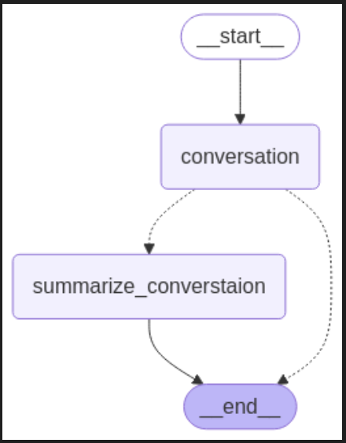

# Chatbot with Memory and External Summary using LangGraph


This project demonstrates a **stateful chatbot** built with `LangGraph`, designed to persist conversations, summarize interactions, and route dynamically based on context. It showcases how to structure conversational flows using a graph-based approach and persistent memory.

---
 ## What is Persistent Memory?

Normally, when you run a chatbot and stop it (or close your notebook), it forgets everything — like a whiteboard getting wiped clean.

But with persistent memory, we save the chatbot’s brain — like writing on a notebook instead of a whiteboard.

In this project, we use SQLite, a tiny built-in database, to save:
	•	The full chat history
	•	Summaries
	•	State of the conversation

So even if you stop and restart the chatbot later, it remembers where things left off — no need to start the chat from scratch!


---

##  Tech Stack

- **LangGraph** – Graph-based LLM workflow orchestration  
- **OpenAI API** – For chat response and summarization  
- **SQLite** – Persistent local memory for conversation state  

---

##  High-Level Architecture

The chatbot is defined as a **stateful graph**, where each node represents a stage in the conversation, and edges define transitions based on logic or user input.





---

## 🧠 State Management

### ✨ Custom `State` Class

```python
from langgraph.graph import MessagesState

class State(MessagesState):
    ...
```

This `State` class, based on LangGraph’s `MessagesState`, manages:

- Chat history  
- Summaries  
- Node context  
- User input/output  

Each node reads from and writes to this object, which travels through the graph

---
## Persistent Memory with SQLite

State is saved using an in-memory SQLite database:
```
conn = sqlite3.connect(":memory:", check_same_thread = False)
```

Swap it with a file for true disk persistence:

```
db_path = "state_db/example.db"
conn = sqlite3.connect(db_path, check_same_thread=False)
memory = SqliteSaver(conn)
```
###  Why this matters:
- Conversations can resume after interruptions  
- Persistent summaries and memory  
- Useful for production and prototyping

---
### Reducer-Style Node Functions
```
def call_model(state: State) -> State:
    # Generate GPT response
    return updated_state

def summarize_converstaion(state: State) -> State:
    # Summarize chat history
    return updated_state
```
These functions:
- Take the current State
- Modify or enrich it
- Return a new State
  
---

##  Features

-  Persistent memory using SQLite – resumes conversations across sessions
-  Context-aware routing using LangGraph nodes
-  Automatic summarization of conversation history
-  Supports looping, branching, and conditional transitions
-  Modular architecture – easy to extend with new nodes or memory backends
  
---
## 📚 References

- [LangGraph Docs]([https://docs.langgraph.dev/](https://langchain-ai.github.io/langgraph/concepts/low_level/))
